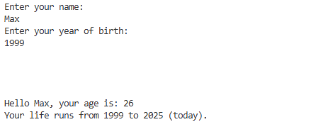

# introduction - short command line script
#### A simple Java program built as a learning exercise for basic Java concepts.

## overview

This program acts as a basic interactive form that collects user information via the command line. It prompts the user for their name and year of birth, then calculates their current age and displays a short introductory message.

## usage

### form

- Enter your name
- Enter your year of birth

### introduction message

After the program has the whole data it claculates your age und shows a short message:

```
Hello <name>, your age is: <age>
Your life runs from <birthyear> to <year today> (today).
```

## Image


